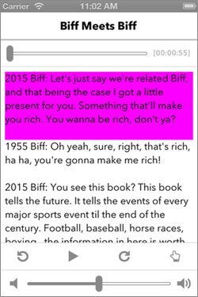
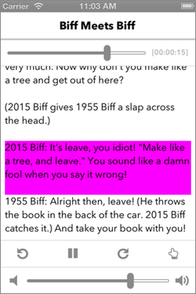
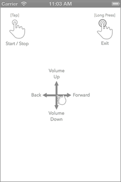

#ArticleReader

**ArticleReader** is a prototyped excerpt of an iOS app that parses web articles into spoken audio files and plays them back with synchronized sentence highlighting.

For this excerpt I supplied pre-converted TTS audio files and cooked up a condensed data model for audio to text synchronization. I also wanted to experiment with gesture controls for audio playback and volume adjustments.

Because this project uses CocoaPods, **make sure to open 'ArticleReader.xcworkspace'** and NOT 'ArticleReader.xcodeproj'.

Here are a few screenshots of the prototype:

  

